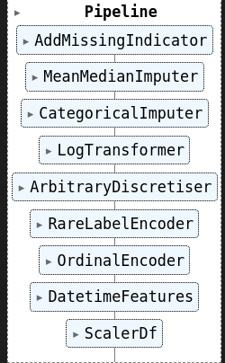

# Modelo para Detección de Fraude
Puedes encontrar la aplicación web haciendo clic [AQUÍ](https://wilmars-fraud-meli-app.hf.space).

## Introducción
El fraude es un problema que afecta a todos los mercados en los que se realizan transacciones, y MercadoLibre está expuesta a este riesgo. Por lo tanto, cualquier esfuerzo realizado para mitigarlo tiene un gran impacto económico. En este caso, propongo una metodología basada en Machine Learning que ayuda a determinar la probabilidad de que una transacción sea fraudulenta, lo que permite tomar medidas como rechazarla o no permitir el método de pago al cliente.

En la carpeta [notebooks](notebooks/), encontrarás un análisis exploratorio de datos donde se exploran todas las posibles transformaciones necesarias para los datos. Puedes consultar este análisis en el archivo [eda.ipynb](notebooks/01-eda.ipynb).


### Feature engineering
Se realizaron diversas transformaciones de los datos, las cuales se detallan en el archivo [feature_engineering.ipynb](notebooks/02-feature_engineering.ipynb). Estas transformaciones dieron lugar a un pipeline que se muestra a continuación:



En este proceso, se aplicaron diversas transformaciones, codificaciones, imputaciones y escalado de datos, todos los cuales se detallan en el cuaderno de trabajo.

Además, se extrajeron características interesantes de la fecha, como el día de la semana y la hora del día, que podrían ser relevantes para la detección de fraudes.


### Feature Selection
Para mejorar el pipeline anterior, se propone un método de selección de características en el cual se introducen variables completamente aleatorias y se mantienen aquellas características que tienen una importancia mayor que estas variables aleatorias. Las características seleccionadas son `['b', 'c', 'h', 'j', 'k', 'l', 'm', 'o', 'monto', 'score', 'fecha_hour', 'fecha_minute', 'fecha_second']`.

 ### Model Training

En el archivo [model_training.ipynb](notebooks/04-model%20_training.ipynb), se lleva a cabo el entrenamiento de varios modelos, y al final se selecciona XGBoost como el modelo que arroja los mejores resultados.

### Explicación de la Función de Costos para Maximizar Ganancias

La función de costos que se ha diseñado tiene como objetivo maximizar las ganancias de la empresa al ajustar el **umbral de decisión** de un modelo de clasificación de fraude. La **matriz de confusión** se utiliza para calcular las ganancias y pérdidas basadas en los valores de **verdaderos positivos (TP)**, **falsos positivos (FP)**, **verdaderos negativos (TN)** y **falsos negativos (FN)**.

 Función `calcular_ganancia_total`

La función `calcular_ganancia_total` recibe la matriz de confusión y calcula la ganancia total de la empresa con base en los valores de **TP**, **FP**, **TN** y **FN**. Las ganancias y pérdidas se calculan de la siguiente manera:

- **Ganancia por transacciones legítimas correctamente identificadas (TN)**:
  - Se asume que por cada transacción legítima correctamente identificada, la empresa gana un **25%** del valor de la transacción.
  
- **Pérdida por transacciones legítimas mal clasificadas (FP)**:
  - Si una transacción legítima es clasificada erróneamente como fraude, la empresa pierde el **100%** del valor de esa transacción.

- **Pérdida por fraudes no detectados (FN)**:
  - Si un fraude no es detectado, la empresa pierde el **100%** del valor de esa transacción.

- **Ganancia por fraudes correctamente detectados (TP)**:
  - No hay ganancia adicional por identificar un fraude correctamente, ya que solo se evita la pérdida total.

La fórmula para calcular la ganancia total es:

\[
G_{total} = (TP \times \text{ganancia\_TP}) + (FP \times \text{ganancia\_FP}) + (TN \times \text{ganancia\_TN}) + (FN \times \text{ganancia\_FN})
\]


 ## Model Deployment
Para desplegar este modelo, se propone realizar predicciones a través de una API. Cuando llega una transacción, el modelo responderá con la probabilidad de fraude. Puedes probarlo en [src/test_api.py](src/test_api.py) y obtener una respuesta en formato JSON:

```
{
  "probability": "0.08703308",
  "prediction": "Fraude"
}
```

La idea es que el servicio backend se conecte a este api.

## Trabajo Futuro
- Agregar versionamiento de datos con DVC como lo hago en [ESTE PROYECTO](https://github.com/Wilmar3752/cluster-app)
- Realizar el API con FastApi (por tiempo no la hice)
- Usar Docker
- Usar CI CD con jenkins o github actions para desplegar automaticamente en una nube como AWS, Azure o GCP
- Crar una base de datos que guarde los request y los response del API